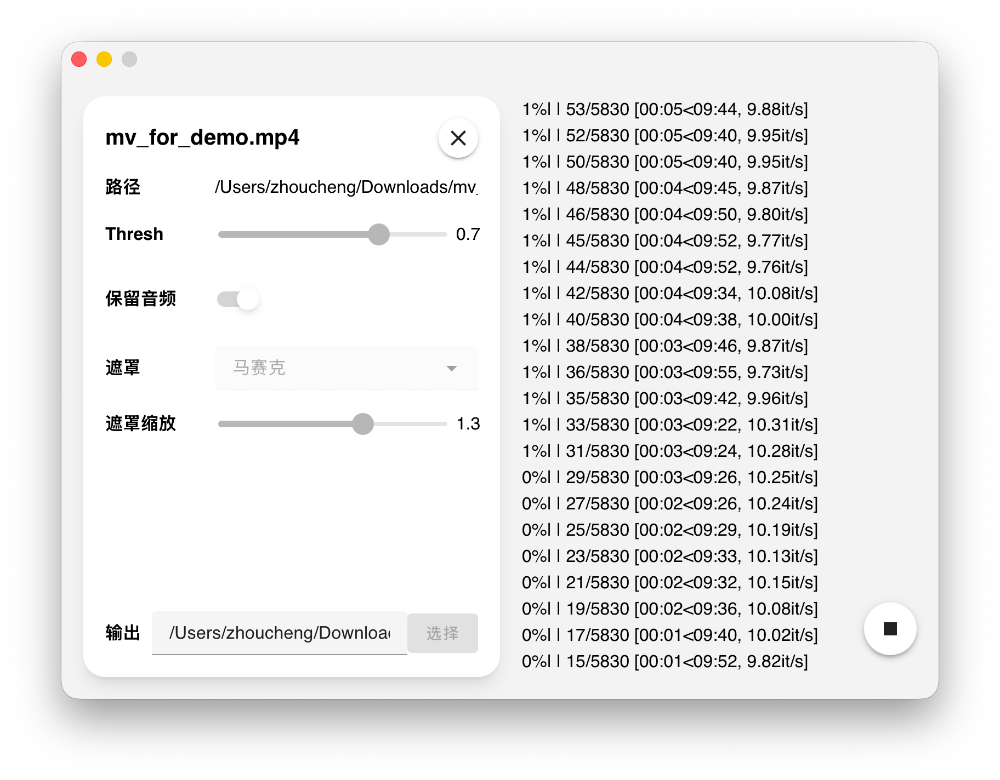

# Deface GUI

## 简介

**基于[Deface](https://github.com/ORB-HD/deface)的GUI程序，使用Tauri开发**

用于将视频里的人物脸进行模糊/马赛克处理

## 截图

## 使用

> [!NOTE]
> 在Windows下命令行输出有点问题（可能卡在1%），但是仍会在运行，完成之后也会有输出  
> 暂时没有找到原因，也许是Deface的bug，如果你知道解决思路欢迎PR

1. 安装[Deface](https://github.com/ORB-HD/deface)，详细安装方法见其仓库
2. 直接使用本App即可